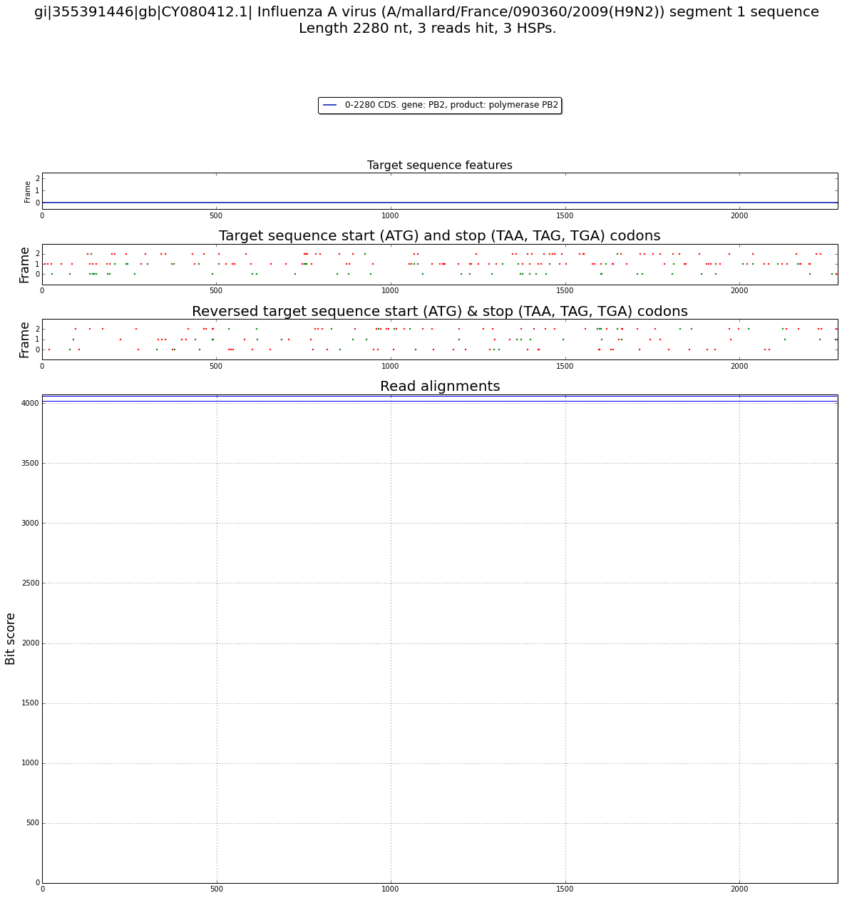
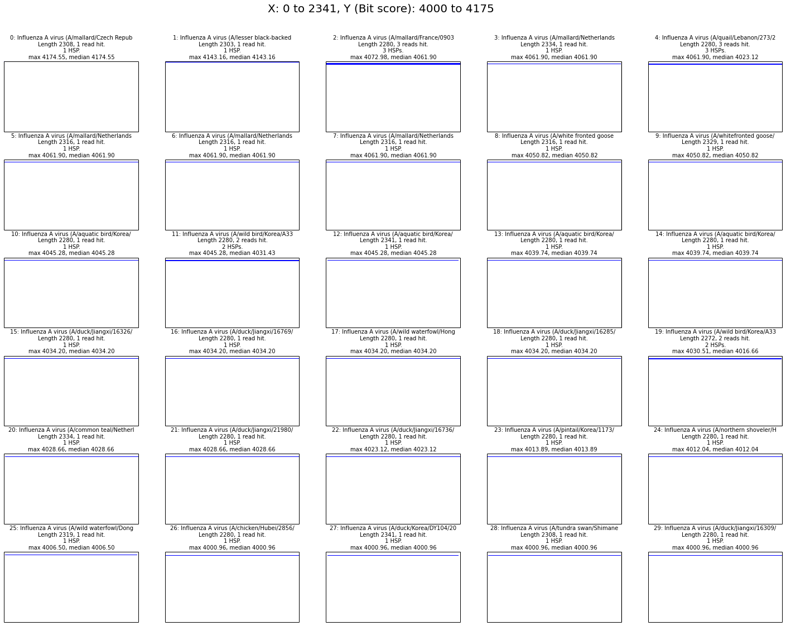

# Using the new code

The key to understanding the new code organization is to understand the
information model and the names given to things in that model. The naming is
close to that used by BLAST. The class names in our code are explicit. They try
to tell you what an instance of that class can be expected to hold. They are
also used consistently.

Below, class names and their instances, like `Read` and `Alignment` are
highlighted and used consistently.

You should pay close attention to singular versus plural in class names.

It will probably be beneficial to pay attention to what actions cause data to be
read from disk/SSD. Data is never read until it's actually needed. So you may be
surprised that some function calls complete instantly whereas others seem like
they should be quick but are actually slow (because they have triggered a chain
of events that causes data to be read).

The information model is hierarchical. We'll start from the bottom.

## Read

A `Read` is a genetic sequence (in our case usually obtained from an NGS run).
It has an `id`, the sequence, and it may have an associated quality.

    from dark.reads import Read
    
    read = Read('id1', 'ACGGTCAACG')
    read.id, read.sequence, len(read)

    ('id1', 'ACGGTCAACG', 10)

    read = Read('id1', 'ACGGTCAACG', '9CA@>>>BB@')
    read.quality

    '9CA@>>>BB@'

    # reverseComplement returns a new Read instance
    rc = read.reverseComplement()
    type(rc), rc.sequence

    (dark.reads.Read, 'CGTTGACCGT')

    # Reads may also consist of RNA or amino acids.
    rnaRead = Read('id2', 'AGUC', type='rna')
    aaRead = Read('id3', 'AFFLT', type='aa')
    
    rnaRead.type, aaRead.type

    ('rna', 'aa')

## Reads

A `Reads` instance is just a collection of `Read` instances. You can add reads
to it manually, you can iterate it, you can filter it for read length (more
filters will be added), and you can save it to a file.

    from dark.reads import Reads

    reads = Reads()
    reads.add(Read('id1', 'ACGGTCAACG'))
    reads.add(Read('id2', 'TCAACG'))
    len(reads)

    2

    for read in reads:
        print read.id

    id1
    id2

    for read in reads.filter(minLength=7):
        print read.id

    id1

    # Save as FASTA
    from StringIO import StringIO
    out = StringIO()
    reads.save(out)  # reads.save('filename') also works
    print out.getvalue()

    >id1
    ACGGTCAACG
    >id2
    TCAACG

    # Save as FASTQ
    from StringIO import StringIO
    out = StringIO()
    reads = Reads()
    reads.add(Read('id1', 'ACGGTCAACG', '9CA@>>>BB@'))
    reads.save(out, 'fastq')
    print out.getvalue()

    @id1
    ACGGTCAACG
    +id1
    9CA@>>>BB@
    

You can load a list of FASTA reads from a file:

    !echo '>id1\nACGT\n>id2\nCCC\n' > /tmp/ipynb-demo-data.fasta
    
    from dark.fasta import FastaReads
    
    for read in FastaReads('/tmp/ipynb-demo-data.fasta'):
        print read.id, read.sequence

    id1 ACGT
    id2 CCC

## Alignment

When you run some kind of alignment program, such as BLAST or bowtie or STAR or
one of many others, the program will take reads and try to match them to a
database of sequences. When a match is found, we call that an `alignment` and we
have a corresponding `Alignment` class for it. Following BLAST, we call the
sequence that a `read` matched against a `subject`.

    from dark.alignments import Alignment
    
    alignment = Alignment(77, 'gi|68448876|gb|DQ011154.1| Monkeypox virus strain Congo_2003_358, complete genome')
    print alignment.subjectLength
    print alignment.subjectTitle

    77
    gi|68448876|gb|DQ011154.1| Monkeypox virus strain Congo_2003_358, complete genome

## High-scoring pairs

A `read` sequence may match a `subject` sequence in multiple places. The
alignment program may therefore report a set of match offsets for a single
read/subject pair. Again following BLAST, we'll call each of these a `high-
scoring pair` or `HSP`.

    from dark.hsp import HSP
    
    hsp1 = HSP(27)
    hsp2 = HSP(34)
    
    hsp1 < hsp2

    True

    hsp1.betterThan(22)

    True

The numeric values above are called `scores`. With an `HSP`, as you would expect
from the name, a higher score is considered better.

We also have a class for alignment programs that produces scores that are better
when they are lower (e.g., BLAST e-values).

    from dark.hsp import LSP
    
    lsp1 = LSP(27)
    lsp2 = LSP(34)
    
    lsp1 < lsp2

    False

    lsp1.betterThan(22)

    False

## Adding HSPs to an Alignment

We can add `HSP`s to a single `read` alignment:

    alignment = Alignment(77, 'gi|68448876|gb|DQ011154.1| Monkeypox virus strain Congo_2003_358, complete genome')
    alignment.addHsp(HSP(14))
    alignment.addHsp(HSP(20))
    
    alignment.hsps

    [<dark.hsp.HSP at 0x109df94d0>, <dark.hsp.HSP at 0x107aac810>]

## Summary of terms so far

A `read` can match a `subject`. If it does so, that's called an `alignment`. It
may match the `subject` in multiple places, each of which is a `high-scoring
pair (HSP)`.

There's obviously more to an `HSP` than just its `score`, though. They also hold
offsets to indicate where in the `read` and the `subject` the match occurred,
but we don't need to think about that right now.

## ReadAlignments

A single `read` might match many `subjects`, so we have a `ReadAlignments` class
(a subclass of `list`) that can hold all the `Alignment`s of a single `read`:

    from dark.reads import Read
    from dark.alignments import Alignment, ReadAlignments
    
    read = Read('id1', 'ACGGTCAACG', '9CA@>>>BB@')
    
    alignment1 = Alignment(77, 'gi|68448876|gb|DQ011154.1| Monkeypox virus strain Congo_2003_358, complete genome')
    alignment1.addHsp(HSP(14))
    alignment1.addHsp(HSP(20))
    
    alignment2 = Alignment(77, 'gi|557951111|gb|KF493731.1| Hirudovirus strain Sangsue, complete genome')
    alignment2.addHsp(HSP(84))
    alignment2.addHsp(HSP(75))
    
    readAlignments = ReadAlignments(read, [alignment1, alignment2])
    
    readAlignments.read, readAlignments

    (<dark.reads.Read at 0x109d3c190>,
     [<dark.alignments.Alignment at 0x109dfc0d0>,
      <dark.alignments.Alignment at 0x109dfc210>])

## ReadsAlignments

Many reads, each with many alignments, each with many HSPs... Now we're getting
somewhere.

You'll typically have a large number of reads and your alignment program will
align them all, producing output (e.g., BLAST XML or SAM/BAM) for all HSPs of
all alignments of all reads. We have a class to hold this, called
`ReadsAlignments`. Note the double pluralization: multiple reads, each with
multiple alignments.

## Getting concrete, with BLAST

The `ReadsAlignments` class is abstract: you have to subclass it with something
more concrete. We only have one example of this at the moment,
`BlastReadsAlignments`. Let's get some real data and see how it works.

    from dark.blast.alignments import BlastReadsAlignments
    
    fastaFile = '../seqs/nic/AI-sequences-segment11-7-2013/segment1.fasta'
    json = '../output/nic/AI-sequences-segment11-7-2013/segment1.json'
    
    reads = FastaReads(fastaFile)
    blastReadsAlignments = BlastReadsAlignments(reads, json)

As you can see, you have to tell `BlastReadsAlignments` about your reads as well
as giving it BLAST output in our custom JSON format.

You can produce our JSON format from BLAST XML in the shell as follows:

    blast -outfmt 5 -out file.xml -db nt -query reads.fasta
    convert-blast-xml-to-json.py file.xml | bzip > file.json.bz2

We have our own JSON format because it is much smaller than BLAST's XML output
and we can parse it 23x more quickly.

## Operating on BlastReadsAlignments

Once you have an instance of `BlastReadsAlignments`, the main things you can do
to it are iterate it and filter it.

If you iterate it, you shouldn't be surprised to hear that the iterator will
yield `ReadAlignments` instances. Pay attention to the naming and the
plural/singular: A `ReadsAlignments` (in this case a `BlastReadsAlignments`) is
a collection of `ReadAlignments`.

### Filtering and iterating

Let's filter the BLAST reads alignments and then iterate on them. There are many
filtering options. Here's an example:

    blastReadsAlignments.filter(maxHspsPerHit=1, titleRegex='influenza', scoreCutoff=4000,
                                negativeTitleRegex='homo sapiens')
    
    for readAlignments in blastReadsAlignments:
        print 'Read with id %s matched the following titles:' % readAlignments.read.id
        for readAlignment in readAlignments:
            print '  ', readAlignment.subjectTitle
        break  # Just print the alignments for one read, to reduce output.

    Read with id 50590-PB2 matched the following titles:
       gi|341610026|gb|JN244101.1| Influenza A virus (A/wild bird/Korea/A330/2009(H7N7)) segment 1 polymerase PB2 (PB2) gene, complete cds
       gi|341610028|gb|JN244102.1| Influenza A virus (A/wild bird/Korea/A331/2009(H7N7)) segment 1 polymerase PB2 (PB2) gene, partial cds
       gi|341610030|gb|JN244103.1| Influenza A virus (A/pintail/Korea/1173/2009(H7N7)) segment 1 polymerase PB2 (PB2) gene, complete cds
       gi|564125838|gb|KF874478.1| Influenza A virus (A/wild waterfowl/Dongting/C2383/2012(H1N2)) segment 1 polymerase PB2 (PB2) gene, complete cds

### Filtering options

Here are the filtering options

        def filter(self, limit=None, minSequenceLen=None, maxSequenceLen=None,
                   minStart=None, maxStop=None,
                   oneAlignmentPerRead=False, maxHspsPerHit=None,
                   scoreCutoff=None, whitelist=None, blacklist=None,
                   titleRegex=None, negativeTitleRegex=None,
                   truncateTitlesAfter=None, taxonomy=None, readIdRegex=None):
            """
            Update self so that __iter__ returns a generator that yields a filtered
            set of C{ReadAlignments}.
    
            @param limit: An C{int} limit on the number of records to read.
            @param minSequenceLen: Sequences of lesser length will be elided.
            @param maxSequenceLen: Sequences of greater length will be elided.
            @param minStart: HSPs that start before this offset in the matched
                sequence should not be returned.
            @param maxStop: HSPs that end after this offset in the matched sequence
                should not be returned.
            @param oneAlignmentPerRead: If C{True}, only keep the best
                alignment for each read.
            @param maxHspsPerHit: The maximum number of HSPs to keep for each
                alignment for each read.
            @param scoreCutoff: A C{float} score. Matches with scores that are not
                better than this score will be ignored.
            @param whitelist: If not C{None}, a set of exact titles that are always
                acceptable (though the match info for a whitelist title may rule it
                out for other reasons).
            @param blacklist: If not C{None}, a set of exact titles that are never
                acceptable.
            @param titleRegex: A regex that sequence titles must match.
            @param negativeTitleRegex: A regex that sequence titles must not match.
            @param truncateTitlesAfter: A string that titles will be truncated
                beyond. If a truncated title has already been seen, that title will
                be elided.
            @param taxonomy: A C{str} of the taxonomic group on which should be
                filtered. eg 'Vira' will filter on viruses.
            @param readIdRegex: A case-sensitive regex C{str} that read ids must
                match.
            @return: C{self}.
            """

Note that when you call `filter` on a `ReadsAlignments` instance, no I/O is
done. The `ReadsAlignments` instance does not attempt to get any data from disk
until it is iterated.

## From ReadsAlignments to titles

We're now going to see how to gather all the data from a `ReadsAlignments`
instance and group it by `subject` title.  You wont always want to do this, but
if you're interested to know how many, or which, reads matched a title, read on.

## TitlesAlignments

We can pass a `ReadsAlignments` instance to a `TitlesAlignments`:

    from dark.titles import TitlesAlignments
    
    titlesAlignments = TitlesAlignments(blastReadsAlignments)

Again, note the pluralization: a `TitlesAlignments` has information about
multiple titles, each of which has multiple alignments. Each of the alignments
is due to a single read, which may match the subject in multiple ways (`HSP`s).

When you create a `TitlesAlignments` instance, you'll cause the underlying data
to be read. So if you have a lot of data, it can be slow to create a
`TitlesAlignments`.

A `TitlesAlignments` is just like a Python `dict` (in fact it's a subclass).

    titlesAlignments.keys()[0]

    u'gi|298659151|gb|CY064947.1| Influenza A virus (A/mallard/Netherlands/5/1999(H2N9)) segment 1 sequence'

    title = 'gi|298659151|gb|CY064947.1| Influenza A virus (A/mallard/Netherlands/5/1999(H2N9)) segment 1 sequence'
    titlesAlignments[title]

    [<dark.titles.TitleAlignment at 0x10af2d790>]

As you might have guessed, each value of a `TitlesAlignments` is a
`TitleAlignments` (note the singular: it's a single title with its multiple
alignments).

## TitleAlignments

    titleAlignments = titlesAlignments[title]
    titleAlignments.subjectLength

    2334

A `TitleAlignments` is actually a subclass of `list`.

    titleAlignments

    [<dark.titles.TitleAlignment at 0x10af2d790>]

And, of course, a `TitleAlignments` is a collection of `TitleAlignment`
instances.

## TitleAlignment

    titleAlignment = titleAlignments[0]
    titleAlignment.read.id

    '50558-PB2'

    titleAlignment.hsps

    [<dark.hsp.HSP at 0x10a4938d0>]

And, after drilling down sufficiently, we arrive back at an `HSP`.

## Filtering a TitlesAlignments

There are several ways to filter a `TitlesAlignments` once all matching reads
for titles have been collected (from the `ReadsAlignments` used to create it):

        def filter(self, minMatchingReads=None, minMedianScore=None,
                   withScoreBetterThan=None, minNewReads=None):
            """
            Filter the titles in self to create another TitlesAlignments.
    
            @param minMatchingReads: titles that are matched by fewer reads
                are unacceptable.
            @param minMedianScore: sequences that are matched with a median
                bit score that is less are unacceptable.
            @param withScoreBetterThan: if the best score for a title is not
                as good as this value, the title is not acceptable.
            @param minNewReads: The C{float} fraction of its reads by which a new
                title's read set must differ from the read sets of all previously
                seen titles in order for this title to be considered acceptably
                different (and therefore interesting).
            @return: A new L{TitlesAlignments} instance containing only the
                matching titles.
            """

    matchedBySeveralReads = titlesAlignments.filter(minMatchingReads=3)
    len(matchedBySeveralReads)

    2

    matchedBySeveralReads.keys()

    [u'gi|355391446|gb|CY080412.1| Influenza A virus (A/mallard/France/090360/2009(H9N2)) segment 1 sequence',
     u'gi|338855247|gb|CY093093.1| Influenza A virus (A/quail/Lebanon/273/2010(H9N2)) polymerase PB2 (PB2) gene, complete cds']

## Making an alignment graph

    %pylab inline
    from dark.graphics import alignmentGraph

    Populating the interactive namespace from numpy and matplotlib

    title = 'gi|355391446|gb|CY080412.1| Influenza A virus (A/mallard/France/090360/2009(H9N2)) segment 1 sequence'
    _ = alignmentGraph(titlesAlignments, title)

    Thu Aug 14 11:38:31 2014: Graph generated in 0.074 mins.

## Making an alignment panel

    from dark.graphics import alignmentPanel
    
    alignmentPanel(titlesAlignments)

    Thu Aug 14 11:38:38 2014: Plotting 30 titles in 6x5 grid, sorted on maxScore
    0: gi|329315490|gb|JF789615.1| Influenza A virus (A/mallard/Czech Republic/13579-84K/2010(H4N6)) segment 1 polymerase PB2 (PB2) gene, complete cds http://www.ncbi.nlm.nih.gov/nuccore/JF789615
    1: gi|459679657|gb|CY138144.1| Influenza A virus (A/lesser black-backed gull/Iceland/145/2010(H11N2)) polymerase PB2 (PB2) gene, complete cds http://www.ncbi.nlm.nih.gov/nuccore/CY138144
    2: gi|355391446|gb|CY080412.1| Influenza A virus (A/mallard/France/090360/2009(H9N2)) segment 1 sequence http://www.ncbi.nlm.nih.gov/nuccore/CY080412
    3: gi|298659151|gb|CY064947.1| Influenza A virus (A/mallard/Netherlands/5/1999(H2N9)) segment 1 sequence http://www.ncbi.nlm.nih.gov/nuccore/CY064947
    4: gi|338855247|gb|CY093093.1| Influenza A virus (A/quail/Lebanon/273/2010(H9N2)) polymerase PB2 (PB2) gene, complete cds http://www.ncbi.nlm.nih.gov/nuccore/CY093093
    5: gi|392719381|gb|CY122251.1| Influenza A virus (A/mallard/Netherlands/11/1999(H2N9)) polymerase PB2 (PB2) gene, complete cds http://www.ncbi.nlm.nih.gov/nuccore/CY122251
    6: gi|392719400|gb|CY122259.1| Influenza A virus (A/mallard/Netherlands/12/1999(H2N9)) polymerase PB2 (PB2) gene, complete cds http://www.ncbi.nlm.nih.gov/nuccore/CY122259
    7: gi|392719419|gb|CY122267.1| Influenza A virus (A/mallard/Netherlands/13/1999(mixed)) polymerase PB2 (PB2) gene, complete cds http://www.ncbi.nlm.nih.gov/nuccore/CY122267
    8: gi|392718220|gb|CY121966.1| Influenza A virus (A/white fronted goose/Netherlands/22/1999(H2N2)) polymerase PB2 (PB2) gene, complete cds http://www.ncbi.nlm.nih.gov/nuccore/CY121966
    9: gi|556585658|gb|KF695190.1| Influenza A virus (A/whitefronted goose/Netherlands/22/1999(H2N2)) segment 1 polymerase PB2 (PB2) gene, complete cds http://www.ncbi.nlm.nih.gov/nuccore/KF695190
    10: gi|326955466|gb|CY088569.1| Influenza A virus (A/aquatic bird/Korea/CN5/2009(H6N5)) polymerase PB2 (PB2) gene, complete cds http://www.ncbi.nlm.nih.gov/nuccore/CY088569
    11: gi|341610026|gb|JN244101.1| Influenza A virus (A/wild bird/Korea/A330/2009(H7N7)) segment 1 polymerase PB2 (PB2) gene, complete cds http://www.ncbi.nlm.nih.gov/nuccore/JN244101
    12: gi|402485373|gb|JX465637.1| Influenza A virus (A/aquatic bird/Korea/CN5/2009(H6N5)) segment 1 polymerase PB2 (PB2) gene, complete cds http://www.ncbi.nlm.nih.gov/nuccore/JX465637
    13: gi|345113962|gb|CY098219.1| Influenza A virus (A/aquatic bird/Korea/CN17/2009(H6N2)) polymerase PB2 (PB2) gene, complete cds http://www.ncbi.nlm.nih.gov/nuccore/CY098219
    14: gi|345114000|gb|CY098235.1| Influenza A virus (A/aquatic bird/Korea/CN9/2009(H6N8)) polymerase PB2 (PB2) gene, complete cds http://www.ncbi.nlm.nih.gov/nuccore/CY098235
    15: gi|523793344|gb|KF260744.1| Influenza A virus (A/duck/Jiangxi/16326/2010(H7N7)) segment 1 polymerase PB2 (PB2) gene, complete cds http://www.ncbi.nlm.nih.gov/nuccore/KF260744
    16: gi|523793348|gb|KF260746.1| Influenza A virus (A/duck/Jiangxi/16769/2010(H7N7)) segment 1 polymerase PB2 (PB2) gene, complete cds http://www.ncbi.nlm.nih.gov/nuccore/KF260746
    17: gi|523793370|gb|KF260757.1| Influenza A virus (A/wild waterfowl/Hong Kong/MPP1311/2013(H2N9)) segment 1 polymerase PB2 (PB2) gene, complete cds http://www.ncbi.nlm.nih.gov/nuccore/KF260757
    18: gi|523793394|gb|KF260769.1| Influenza A virus (A/duck/Jiangxi/16285/2010(H7N3)) segment 1 polymerase PB2 (PB2) gene, complete cds http://www.ncbi.nlm.nih.gov/nuccore/KF260769
    19: gi|341610028|gb|JN244102.1| Influenza A virus (A/wild bird/Korea/A331/2009(H7N7)) segment 1 polymerase PB2 (PB2) gene, partial cds http://www.ncbi.nlm.nih.gov/nuccore/JN244102
    20: gi|294441333|gb|CY060187.1| Influenza A virus (A/common teal/Netherlands/9/2000(H11N9)) segment 1 sequence http://www.ncbi.nlm.nih.gov/nuccore/CY060187
    21: gi|523793350|gb|KF260747.1| Influenza A virus (A/duck/Jiangxi/21980/2010(H7N7)) segment 1 polymerase PB2 (PB2) gene, complete cds http://www.ncbi.nlm.nih.gov/nuccore/KF260747
    22: gi|523793346|gb|KF260745.1| Influenza A virus (A/duck/Jiangxi/16736/2010(H7N3)) segment 1 polymerase PB2 (PB2) gene, complete cds http://www.ncbi.nlm.nih.gov/nuccore/KF260745
    23: gi|341610030|gb|JN244103.1| Influenza A virus (A/pintail/Korea/1173/2009(H7N7)) segment 1 polymerase PB2 (PB2) gene, complete cds http://www.ncbi.nlm.nih.gov/nuccore/JN244103
    24: gi|523793442|gb|KF260793.1| Influenza A virus (A/northern shoveler/Hong Kong/MPL133/2010(H2N9)) segment 1 polymerase PB2 (PB2) gene, complete cds http://www.ncbi.nlm.nih.gov/nuccore/KF260793
    25: gi|564125838|gb|KF874478.1| Influenza A virus (A/wild waterfowl/Dongting/C2383/2012(H1N2)) segment 1 polymerase PB2 (PB2) gene, complete cds http://www.ncbi.nlm.nih.gov/nuccore/KF874478
    26: gi|224181207|gb|FJ784835.1| Influenza A virus (A/chicken/Hubei/2856/2007(H5N1)) segment 1 polymerase PB2 (PB2) gene, complete cds http://www.ncbi.nlm.nih.gov/nuccore/FJ784835
    27: gi|402485316|gb|JX454720.1| Influenza A virus (A/duck/Korea/DY104/2007(H4N6)) segment 1 polymerase PB2 (PB2) gene, complete cds http://www.ncbi.nlm.nih.gov/nuccore/JX454720
    28: gi|523567469|dbj|AB830625.1| Influenza A virus (A/tundra swan/Shimane/3211A001/2011(H5N2)) viral cRNA, segment 1, complete sequence http://www.ncbi.nlm.nih.gov/nuccore/AB830625
    29: gi|523793342|gb|KF260743.1| Influenza A virus (A/duck/Jiangxi/16309/2010(H7N7)) segment 1 polymerase PB2 (PB2) gene, complete cds http://www.ncbi.nlm.nih.gov/nuccore/KF260743
    Thu Aug 14 11:38:46 2014: Alignment panel generated in 0.150 mins.

## Subtleties not mentioned above

### Convenient imports via ipynb.py

If you use

    from dark.ipynb import *

several useful classes will be imported. This makes it easier to work in iPython
Notebook without the need for many explicit imports. You'll pick up:

`BlastReadsAlignments`
`FastaReads`
`TitlesAlignments`
`alignmentGraph`
`alignmentPanel`
`scoreGraph`
`summarizeTitlesByCount`
`summarizeTitlesByLength`
`summarizeTitlesByMaxScore`
`summarizeTitlesByMedianScore`
`summarizeTitlesByTitle`
`titleCounts`

### titleCounts

If you have a `ReadsAlignments` instance and you're curious to know what titles
are matched and how many times, you can use `titleCounts`:

    from dark.titles import titleCounts
    
    counts = titleCounts(blastReadsAlignments)

`titleCounts` returns a `dict` whose keys are `subject` titles and whose keys
are the number of reads that matched that title.

    len(counts)

    30

    sortedTitles = sorted(counts.keys(), key=lambda title: counts[title], reverse=True)
    sortedTitles[:5]

    [u'gi|338855247|gb|CY093093.1| Influenza A virus (A/quail/Lebanon/273/2010(H9N2)) polymerase PB2 (PB2) gene, complete cds',
     u'gi|355391446|gb|CY080412.1| Influenza A virus (A/mallard/France/090360/2009(H9N2)) segment 1 sequence',
     u'gi|341610028|gb|JN244102.1| Influenza A virus (A/wild bird/Korea/A331/2009(H7N7)) segment 1 polymerase PB2 (PB2) gene, partial cds',
     u'gi|341610026|gb|JN244101.1| Influenza A virus (A/wild bird/Korea/A330/2009(H7N7)) segment 1 polymerase PB2 (PB2) gene, complete cds',
     u'gi|298659151|gb|CY064947.1| Influenza A virus (A/mallard/Netherlands/5/1999(H2N9)) segment 1 sequence']

Note that calling `titleCounts` forces the alignment data to be read. But apart
from the title names and their counts, all data is discarded. Thus `titleCounts`
gives you a fast and low-memory way to get an idea of what titles are matched,
and by how many reads. This can be useful in deciding how to filter alignments
before creating a `TitlesAlignments` instance.

### Working with BLAST e-values

By default, a `BlastReadsAlignments` instance will pull the BLAST "bit score"
from the BLAST output and use that as a score.

If you prefer to work with BLAST e-values, it's easy. Just pass
`scoreClass=LowerIsBetterScore` to the `BlastReadsAlignments` constructor:

    from dark.blast.alignments import BlastReadsAlignments
    from dark.score import LowerIsBetterScore
    
    fastaFile = '../seqs/nic/AI-sequences-segment11-7-2013/segment1.fasta'
    json = '../output/nic/AI-sequences-segment11-7-2013/segment1.json'
    
    reads = FastaReads(fastaFile)
    blastReadsAlignments = BlastReadsAlignments(reads, json, scoreClass=LowerIsBetterScore)

### A `FastaReads` instance doesn't know how long it is until is has read the reads:

    !echo '>id1\nACGT\n>id2\nCCC\n' > /tmp/ipynb-demo-data.fasta
    
    reads = FastaReads('/tmp/ipynb-demo-data.fasta')
    print len(reads)
    
    list(reads)  # This causes the reads to be read from the file.
    print len(reads)

### Score classes

Scores in `HSP` and `LSP` classes are implemented by two `score` classes. It is
those classes that know how to compare themselves properly:

    from dark.score import HigherIsBetterScore
    
    score = HigherIsBetterScore(77)
    score.betterThan(70)

    score.score

    from dark.score import LowerIsBetterScore
    
    score = LowerIsBetterScore(77)
    score.betterThan(70)

So although it looks like `HSP` instances know how to compare themselves
correctly, it is actually their scores that are doing the work.

### Working with multiple JSON files

If you are working with multiple JSON files in iPython Notebook, here's how you
can collect them all to pass to `BlastReadsAlignments`:

    from glob import glob
    
    fastaFile = '../output/emc-rna-seq/3697/Trinity.fasta'
    json = glob('../output/emc-rna-seq/3697/*.json.bz2')
    reads = FastaReads(fastaFile)
    blastAlignments = BlastReadsAlignments(reads, json)
    
    json

    ['../output/emc-rna-seq/3697/0.json.bz2',
     '../output/emc-rna-seq/3697/1.json.bz2',
     '../output/emc-rna-seq/3697/10.json.bz2',
     '../output/emc-rna-seq/3697/11.json.bz2',
     '../output/emc-rna-seq/3697/12.json.bz2',
     '../output/emc-rna-seq/3697/13.json.bz2',
     '../output/emc-rna-seq/3697/14.json.bz2',
     '../output/emc-rna-seq/3697/15.json.bz2',
     '../output/emc-rna-seq/3697/16.json.bz2',
     '../output/emc-rna-seq/3697/17.json.bz2',
     '../output/emc-rna-seq/3697/18.json.bz2',
     '../output/emc-rna-seq/3697/19.json.bz2',
     '../output/emc-rna-seq/3697/2.json.bz2',
     '../output/emc-rna-seq/3697/20.json.bz2',
     '../output/emc-rna-seq/3697/21.json.bz2',
     '../output/emc-rna-seq/3697/3.json.bz2',
     '../output/emc-rna-seq/3697/4.json.bz2',
     '../output/emc-rna-seq/3697/5.json.bz2',
     '../output/emc-rna-seq/3697/6.json.bz2',
     '../output/emc-rna-seq/3697/7.json.bz2',
     '../output/emc-rna-seq/3697/8.json.bz2',
     '../output/emc-rna-seq/3697/9.json.bz2']

### Looking at the size of your JSON inputs

Continuing from the above, let's see the size of all those JSON files

    total = 0
    for j in json:
        wc = !bzcat {j} | wc -c
        bytes = int(wc[0])
        print '%s bytes in %s' % (bytes, j)
        total += bytes
    print 'Total bytes found in %d json.bz2 files = %d' % (len(json), total)

    39899298 bytes in ../output/emc-rna-seq/3697/0.json.bz2
    39134460 bytes in ../output/emc-rna-seq/3697/1.json.bz2
    43452425 bytes in ../output/emc-rna-seq/3697/10.json.bz2
    11430442 bytes in ../output/emc-rna-seq/3697/11.json.bz2
    22996557 bytes in ../output/emc-rna-seq/3697/12.json.bz2
    34544741 bytes in ../output/emc-rna-seq/3697/13.json.bz2
    20296647 bytes in ../output/emc-rna-seq/3697/14.json.bz2
    14332984 bytes in ../output/emc-rna-seq/3697/15.json.bz2
    29093745 bytes in ../output/emc-rna-seq/3697/16.json.bz2
    58065015 bytes in ../output/emc-rna-seq/3697/17.json.bz2
    17795572 bytes in ../output/emc-rna-seq/3697/18.json.bz2
    23790016 bytes in ../output/emc-rna-seq/3697/19.json.bz2
    25076812 bytes in ../output/emc-rna-seq/3697/2.json.bz2
    22079815 bytes in ../output/emc-rna-seq/3697/20.json.bz2
    8637711 bytes in ../output/emc-rna-seq/3697/21.json.bz2
    32861961 bytes in ../output/emc-rna-seq/3697/3.json.bz2
    18956272 bytes in ../output/emc-rna-seq/3697/4.json.bz2
    87206492 bytes in ../output/emc-rna-seq/3697/5.json.bz2
    27994649 bytes in ../output/emc-rna-seq/3697/6.json.bz2
    207625431 bytes in ../output/emc-rna-seq/3697/7.json.bz2
    26789563 bytes in ../output/emc-rna-seq/3697/8.json.bz2
    82179041 bytes in ../output/emc-rna-seq/3697/9.json.bz2
    Total bytes found in 22 json.bz2 files = 894239649
